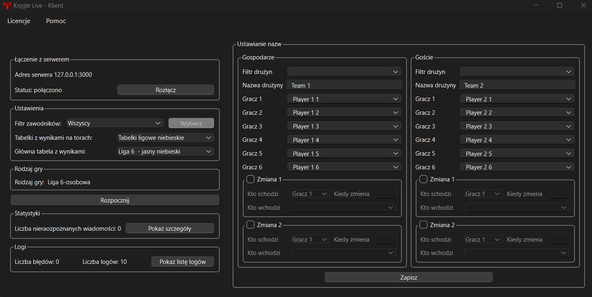
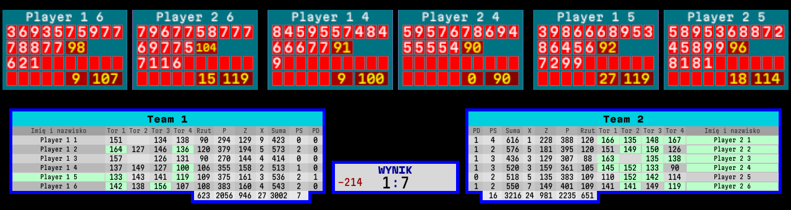
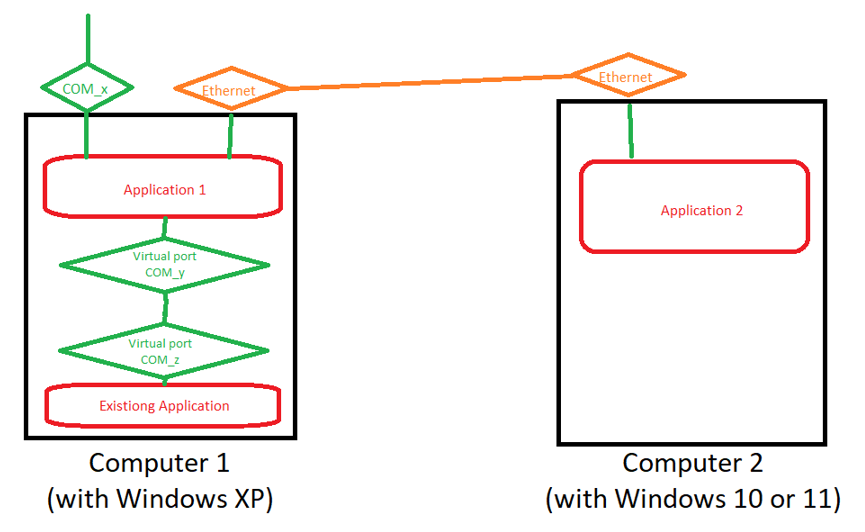

# KregleLive_3_Client

KregleLive_3_Client is part of a bigger project. Together with [KregleLive_3_Server](https://github.com/patlukas/KregleLive_3_Server), it creates a system for generating live score tables. This application was tested and works with Python 3.13. The requirements are listed in `requirements.txt`.

KregleLive_3_Client receives data from KregleLive_3_Server over TCP. KregleLive_3_Server gets this data from bowling lanes.

## Features
- Receives live data from KregleLive_3_Server.
- Generates score tables for live events.
- Easy to configure and use.

## Requirements
- Windows
- Python 3.13
- Libraries listed in `requirements.txt`

## Installation
1. Clone the repository:
   ```bash
   git clone https://github.com/patlukas/KregleLive_3_Client
   ```
2. Install the required libraries:
   ```bash
   pip install -r requirements.txt
   ```

## Running the Application
1. Make sure KregleLive_3_Server is running and configured.
2. Run the KregleLive_3_Client:
   ```bash
   python main.py
   ```

## Building the Application
You can build the application yourself using `pyinstaller`:
```bash
pyinstaller pyinstaller.spec
```
Or you can download the pre-built `.exe` file from the [Releases](https://github.com/patlukas/KregleLive_3_Client/releases) section.

## Configuration
The project comes with a pre-prepared configuration. You don’t need to change anything to start using it.

## Directory with Logs
The log directory is located at: `%PROGRAMDATA%\KL3_C\logs\`

## 📌 Version History

| Version          | Release Date      | Commits | Changes                                      |
|------------------|-------------------|---------|----------------------------------------------|
| **v1.2.0.0**     | 🚧 In Development | 50+     |                                              |
| **v1.1.3.0**     | 2025-02-28        | 46      | Added Jenkins to create new releases         |  
| **v1.1.1**       | 2025-02-21        | 42      | Added waiting for a response from the lanes  |
| **v1.1.0**       | 2025-02-05        | 38      | Added automatic creation of TCP server       |
| **v1.0.6**       | 2025-11-22        | 34      | Added support for Polish characters          |
| **v1.0.5**       | 2024-11-02        | 33      | Added dropdown with possible IP addresses    |
| **v1.0.4**       | 2024-08-13        | 28      |                                              |
| **v1.0.3**       | 2024-08-08        | 21      |                                              |
| **v1.0.2**       | 2024-06-15        | 15      |                                              |
| **v1.0.1**       | 2023-10-19        | 10      |                                              |
| **First commit** | 2023-06-30        | 1       |                                              |


## Screenshots
Here are some screenshots of the application:

### Application Interface


### Example Generated Tables


### System Diagram (this project is "Application 2"0)

